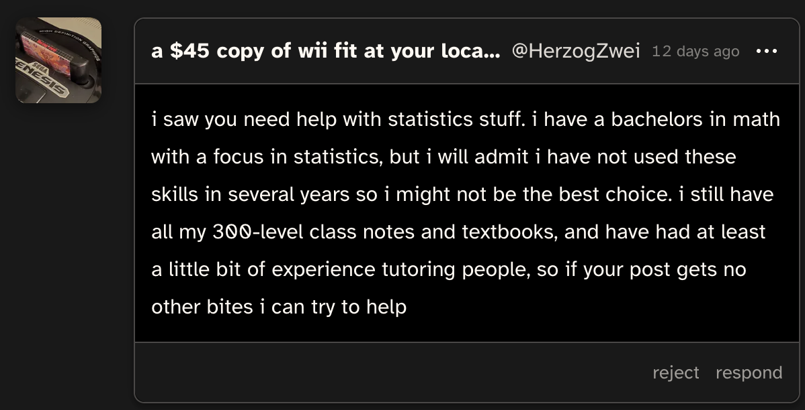

# June 1st

## 11:30am
Soooooooo you might have noticed that I skipped two weeks. It honestly sucks that I didn't completely follow through with what I wanted to do from the start, that being a *daily* journal. But hey, I still got over half a month of stuff, so it's not a *total* loss.  
Regardless, I found out shortly after I made my last post on here that the senior deadline is May 31st, and if you noticed the date above, you'll realize that today is after that day. What's the outcome of everything? Let me briefly go over what the last two weeks had for me.

So a few days after my last entry, I made [this](https://cohost.org/Spax/post/6041547-if-anyone-knows-some) chost, just to see if anyone was willing to help me finish my statistics. VERY fortunately, I got an ask later that day by [`@HerzogZwei`](https://cohost.org/HerzogZwei), as seen below.

Turns out that HE WAS MY SAVING GRACE IN STATISTICS. I forgot to answer his ask but he commented on one of my later chosts about schoolwork and (after apogolizing) I hit him up on discord.

"SPAX," I hear you ask, "I thought you weren't going on discord??" Incredible observation. I didn't ideally want to use discord, but it felt the most convenient. However, I was NOT using my main account, so I used my "main alt" account. I still didn't have discord on my phone so I used browser discord on mobile (Which kinda sucks ass but better than reinstalling discord). So I told Herzog what I knew so far, what material I needed to do, and all other relevant information. Over the next few days, I went back and forth with him, trying to understand what he was explaining to me, and I ended up getting extremely distracted on cohost (focusing is so hard) and it would take me up to an hour to respond to his last message. Even through all that though, he was so incredibly patient with me, and I genuinely cannot thank him enough for staying with me the entire time. On tuesday the following week, I submitted the work to my teacher, and she accepted it. Statistics was OVER.

To catch you up on what I needed to do:
- Statistics packet
- A handful of english assignments
- Two finals for my remediated classes
- A shit ton of sociology work

And that was IT. Condensing the list down to that felt so nice, especially since I had just crossed off the statistics. Just english, remediation, and sociology.

English was my next target. But it actually ended up being way easier than I expected. I submitted the two assignments that were partially complete, I repurposed a "photo collage" assignment from another class, and I had to complete a handful of quizzes from this online program. I spent wednesday this week getting all of them in, and the next day, my grade was passing. TWO DOWN.

I also hear you say "Two weeks passed and we're already onto this week?" Yea, I kinda spent that first week doing that statistics stuff and getting majorly distracted. Oh well.

Now in my mind, at this point, I was trying to weigh everything I had to do and figure out *when* specifically I was gonna do it. This included when I was taking the finals for my remediation. I was scared about it, because I hadn't studied, probably *wasn't* gonna study, and I had little time left to take them. So I said "fuck it" and took the financial literacy one on wednesday. Passed it. I felt like I knew the material well enough so I wasn't worried about that one. Government on the other hand, I was really worried about, since I didn't remember all the different law cases or whatever that they did. I took that one on thursday, and... passed it with a higher score than financial literacy????? Honestly I'll take it. REMEDIATION. OVER.

I was down to the very last thing: sociology. This is the one I was dreading the most, because the work involved watching videos and reading articles and answering a lot of questions, which compared to doing some math and a bit of personal writing, is pretty bad for me. It was still thursday, and I actually had no idea how many assignments I needed to do to pass. It also wasn't just one quarter like english or statistics. It was this quarter and the last quarter. So I was like, "let me actually calculate exactly which assignments are the best ones to complete so I can get my grade up". Turns out, [this](https://cohost.org/Spax/post/6189952-i-m-writing-a-script) is what happens when you do that. An overhauled userscript (made ENTIRELY from scratch) that lets the user visually change their grades and LIVE UPDATES the predicted final grade, and supports direct user input. It also doesn't take exempt and ungraded assignments into account.

This actually ended up being insanely helpful, as I spent the rest of that night doing the assignments that I could see lifted my grade the most. (These ended up being the automatically-graded quizzes that I could still ace). I stayed up until 3:30 am to get as much done as I mentally was capable of that night, and the next day, friday (yesterday), the deadline for the semester, was spent *also* doing as many assignments as I could.

Sidenote about the script I wrote: PowerSchool, the service that my school uses to show final grades, has a really weird weighting system???? My teacher has on his syllabus that tests were 50%, test prep was 40%, and this one thing called "habits of mind" is 10%. I factored weighting into my script, and powerschool says it's 3 percent points lower than it should be??? So I added a "range" to it that says the grade is somewhere between -3 and +3 of the calculated grade.

So where am I now? Well, quarter 4 for sociology was changed to above passing, at 1:43am today. Quarter 3 on the other hand, doesn't look like it's faced any changes. From my calculator, I've expected to *barely* get above a pass, so I'm sorta in limbo (gd fans shut up) until monday, when grades "officially" "lock" on monday for teachers. In the absolute worst case, where I don't pass quarter 3, I'm going to have to absolutely SPEEDRUN remediation for sociology. It will suck so bad, but hey, a failsafe is better than nothing.

I also got a tip-off from my graphic design teacher that, when she had the list of student names that weren't graduating, I wasn't on it. Which was reassuring.

So! June 1st! Pride month! One day after the end of quarter 4 for seniors! Am I graduating? Probably! Will I be doing this again? God I hope not!!

This also raises the question: what am I going to do with this journal? Honestly, I don't know. What's most likely gonna happen is that I'll archive it today and private it next week.

And discord? How long will I stay off of discord for? Not gonna lie, I was planning on going back on it today. Haven't decided whether I'll go back on it *fully* or if I'm just gonna check-in. I also *sorta* checked in again couple days ago. I got my access token, the ID of a channel, and a message I wanted to send, so I asked on cohost how I could send a message on discord via commandline, and got a pretty good answer from [`@cefqrn`](https://cohost.org/cefqrn). So I sent a message in the discord server I own saying that it's almost over and that I'll be back soon. I also shared a [small commission I got on cohost](https://cohost.org/CoolTimesOnline/post/6165238-this-rat-https-s) of the spinning rat.

Oh, and my school computer. Senior laptop collection is June 4th. Later today I'm planning on recording a video about everything I got away with during the school year and uploading it to youtube after editing it a bit (like pacing and editing out personal info). Gotta make a list of all the points to go over. I'll be doing another export of my google data since my school account will be erased that day as well. I'll also be archiving most of my disk.

God, it feels so weird that it's all over next week.

I was about to end the journal here, but no, I'll probably do that on sunday or something.

But that's it for now.

[Back](./../may/18.md) | Next
