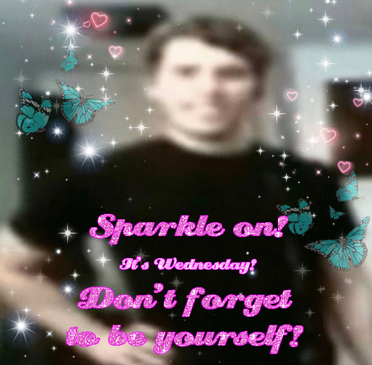
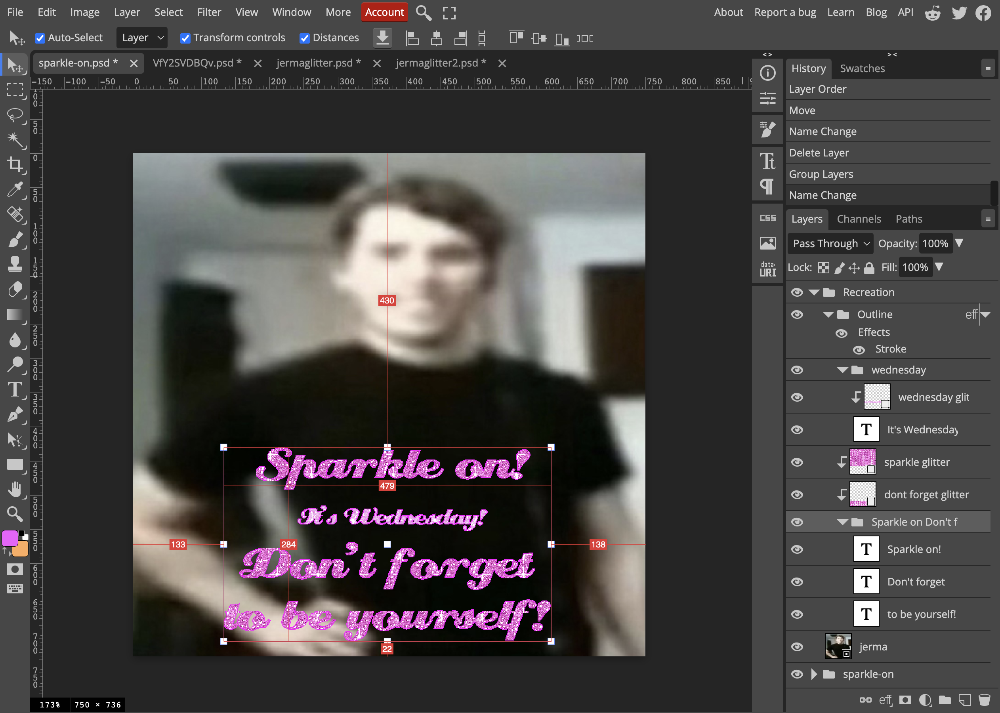

# May 15th

## 8:00am
<div align="center"></div>

Sparkle on! It's Wednesday! Don't forget to be yourself!

God I love this image. I remember asking [the creator of this image](https://www.tumblr.com/charrfie/688822353932713984/sparkle-on-its-wednesday-dont-forget-to-be) something about it a year ago but I can't find the ask I made :(. Later edit: [NVM FOUND IT](https://charrfie.tumblr.com/post/720137946673676288/yooooo-youre-the-creator-of-the-sparkle-on-gif-i)

Anyways, to mirror a [chost I made](https://cohost.org/Spax/post/5978839-i-had-a-dream-where):

> I had a dream where I was in london and I was getting like kfc from a booth or something and a kid with a buzz cut and a blue shirt tried to steal my wallet from my backpack and he was fucking latched on it, and I tried hitting him or SOMETHING and then he said something like "I hope I can do the same to your dog" and then fled with my wallet and since it was a dream I couldn't catch up to him
> 
> I missed my bus this morning

So remember when I said I had an early night last night? Turns out I was probably in deep sleep during the time I normally get up and I slept RIGHT through my alarm. Woke up about half an hour later.

Regardless, I'm at school now so we ball (was about half an hour late but whatever).

## 9:30am
Okay so I've gone down a rabbit hole of recreating the "sparkle on" image and I think it's going well.

I have the original jerma image used, because the creator replied to it with the edited one. The surrounding butterfly and heart graphics were supposedly made in picsart.com which is unfortunately blocked on my school computer (and not on my phone but I need to install an app for it on mobile which i am NOT doing) so I'll wait until I get home to finish editing that aspect of it.

The creator said that they didn't know what program they used so I just googled "glitter text generator" and the first result was a site called [gigaglitters.com](https://www.gigaglitters.com/glitter.php), and I'm actually amazed I got it on the first hit. I went through each font option until I landed on ["Cream Puff"](https://www.1001fonts.com/creampuff-font.html), and it seemed to be an exact match. Most of the text ("Sparkle on!" and "Don't forget to be yourself!") uses the [93rd](https://www.gigaglitters.com/img/DCglit93.gif) glitter type (12th row 3rd column in the picker) and the "It's Wednesday!" text specifically uses the [127th](https://www.gigaglitters.com/img/DCglit127.gif) glitter type (21st row 6th column in the picker)

Used this bit of javascript to select the row and column:

```js
//removes the empty table rows that exist for some reason??
document.querySelectorAll("tr:not(tr:has(> *))").forEach(e=>e.remove());
let row = 21;
let col = 6;
document.querySelector(`th tr:nth-of-type(${row}) > td:nth-of-type(${col})`);
```

For the text, I downloaded the Cream Puff font and imported it into photoshop. I played around with the size and tracking and found that this version was slightly different from the one gigaglitters uses, but I think that's fine tbh. I set the text interpolation to "None" so I could have crisp aliased edges, and put the text inside of a group that had the "stroke" layer style. Set its properties to 1px width, inside position, dissolve blend mode (couldn't think of another way to get full opacity for stuff), and checked overprint. The color is `#ff00ff` which is literally pure magenta. And boom! Text that's near-perfect! It would be great if I could figure out how to make the outline solid without the dissolve bullshit<sup title="as an aside, &quot;dissolve&quot; sets each pixel to either fully opaque or transparent depending on its opacity before then. If the pixel is fully opaque, it gets fully rendered. If it's fully transparent, it doesn't get rendered. If it's 50% opaque, then it has a 50% chance of rendering fully opaque. If it's 33% opaque, then it has a 33% chance of rendering fully opaque. Yes, there is randomness.">[?]</sup>. Photoshop needs to have a custom blend mode feature. That would be amazing.  
I also figured out how to make a pattern in photoshop (Select area > Edit > Define New > Pattern) and created one for each of the three frames of each pattern. Put them on rectangle shapes and adjusted their offsets. ~~Sadly clipping masks don't work very well with animated stuff so I'll have to export each of them separately (but it's fine because doing it 3 times is not that bad)~~ no actually it turns out it's fine so long as the text is in the same folder as the animated frames so yippee!

I'm also pretty sure the "It's Wednesday!" text was scaled down. I'll figure out how to pull that off while still making it editable.

Anyways, this is the culmination of what I have so far:
<div align="center"></div>

I'll leave it at that for now- oh uh let me save it so I don't risk suddenly losing it. Okay done! `sparkle-on.psd` now exists on my 'puter! 7.3 megabytes too. not bad. (For reference I have a project with a super large canvas and the psd is like, 500 megabytes lmfao).

I'm gonna try make a chost with the separated text. Prechoster doesn't work in my version of chrome (it's too much of a hassle to update at this point in the year) and it's blocked on school wifi so I gotta locally host it and then go to it in safari. I love workarounds.

Okay I made a chost (will link it later).

[Back](./14.md) | Next
